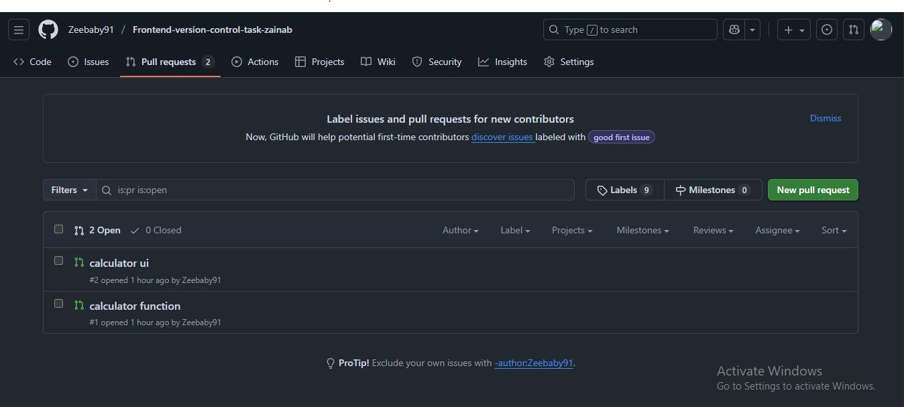

# Frontend-version-control-task-zainab

This repository demonstrates my understanding of Git and GitHub workflows — including branching, committing, pull requests, merging, reverting changes, and collaboration using version control.
### Branches and Their Purposes
- **main** – The main branch containing the stable version of the project.
- **feature-ui** – Contains the HTML and CSS code for the calculator interface.
- **feature-function** – Handles all JavaScript logic and arithmetic operations.
- **feature-header** – Adds a header section to the project page.

### Merged Pull Requests
Below are the screenshots of merged PRs:

### Git Actions and Commands Used
- `git init` – Initialized a new Git repository.
- `git add .` – Staged all changes.
- `git commit -m "Added calculator HTML structure"` – Saved changes with a message.
- `git branch feature-ui` – Created a new branch for the calculator UI.
- `git checkout feature-ui` – Switched to the feature branch.
- `git merge feature-function` – Merged functionality into the main branch.
- `git push` – Uploaded commits to GitHub.
- Created Pull Requests and merged them on GitHub.
- Used GitHub interface to revert a mistaken commit.

### Lessons Learnt
- I learned how to create and manage multiple branches in Git.
- I now understand how to make pull requests and merge them safely.
- I practiced reverting commits and resolving small version control mistakes.

